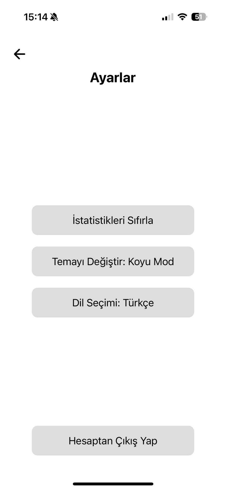

# Flag Guess App

Flag Guess App, dünya ülkelerinin bayraklarını tanıma ve öğrenme üzerine odaklanmış eğitici bir mobil uygulamadır. Kullanıcılar bayrakları tahmin ederek eğlenirken aynı zamanda bilgilerini geliştirebilirler.

## Ekran Görüntüleri
Uygulamanın ekran görüntüleri ve tanıtım videosu ilerleyen zamanlarda eklenecektir.
<<<<<<< HEAD




=======

>>>>>>> 5c1e3bd765af1e833763cdda6f046a32c9aaf935
## Özellikler
- **Bayrak Tahmin Oyunu**: Ülkelerin bayraklarını tahmin edin ve puan kazanın.
- **Eğitim Modu**: Bayraklar hakkında bilgi edinin.
- **Skor Takibi**: Kendi başarılarınızı ve ilerlemenizi takip edin.
- **Liderlik Tablosu**: Arkadaşlarınız ve diğer kullanıcılarla yarışın.

## Kullanılan Teknolojiler
<<<<<<< HEAD
- **Expo**: React Native projeleri için hızlı geliştirme ortamı.
- **React Native**: Uygulama arayüzünün geliştirilmesi için.
- **Firebase**: Kullanıcı kimlik doğrulama, veri tabanı ve analitik işlemleri için.
=======
- **React Native**: Uygulama arayüzünün geliştirilmesi için.
- **Firebase**: Kullanıcı kimlik doğrulama, veri tabanı ve analitik işlemleri için.
- **Redux**: Uygulama durum yönetimi için.
>>>>>>> 5c1e3bd765af1e833763cdda6f046a32c9aaf935

## Kurulum

Proje dosyalarını klonlayarak uygulamayı çalıştırabilirsiniz. Adımlar:

1. **Depoyu klonlayın**:
    ```bash
    git clone https://github.com/kullaniciadi/FlagGuessApp.git
    ```

2. **Bağımlılıkları yükleyin**:
    ```bash
    npm install
    ```

<<<<<<< HEAD
3. **Expo'yu yükleyin** (Eğer Expo CLI sisteminizde kurulu değilse):
    ```bash
    npm install -g expo-cli
    ```

4. **Projenizi çalıştırın**:
    ```bash
    expo start
    ```

5. **Çevresel Değişkenleri Ayarlayın**:
=======
3. **Projenizi çalıştırın**:
    - Android:
      ```bash
      npm run android
      ```
    - iOS:
      ```bash
      npm run ios
      ```

4. **Çevresel Değişkenleri Ayarlayın**:
>>>>>>> 5c1e3bd765af1e833763cdda6f046a32c9aaf935
    Proje kök dizininde `.env` dosyasını oluşturun ve Firebase yapılandırma bilgilerinizi ekleyin.

    Örnek `.env`:
    ```env
    REACT_APP_FIREBASE_API_KEY=YOUR_API_KEY
    REACT_APP_FIREBASE_AUTH_DOMAIN=YOUR_AUTH_DOMAIN
    REACT_APP_FIREBASE_PROJECT_ID=YOUR_PROJECT_ID
    REACT_APP_FIREBASE_STORAGE_BUCKET=YOUR_STORAGE_BUCKET
    REACT_APP_FIREBASE_MESSAGING_SENDER_ID=YOUR_SENDER_ID
    REACT_APP_FIREBASE_APP_ID=YOUR_APP_ID
    REACT_APP_FIREBASE_MEASUREMENT_ID=YOUR_MEASUREMENT_ID
    ```

## Katkıda Bulunma

1. Bu depoyu **fork** edin.
2. Yeni bir dal oluşturun:
    ```bash
    git checkout -b yeni-ozellik
    ```
3. Yaptığınız değişiklikleri commit edin:
    ```bash
    git commit -m "Yeni bir özellik eklendi"
    ```
4. Dalınızı bu depoya gönderin:
    ```bash
    git push origin yeni-ozellik
    ```
5. **Pull Request** açarak katkıda bulunun.

<<<<<<< HEAD

## Expo QR Kod ile Test Etme
Eğer Expo Go uygulamasını kullanıyorsanız, aşağıdaki adımlarla projenizi test edebilirsiniz:

1. `expo start` komutunu çalıştırın.
2. Geliştirme ortamında oluşturulan QR kodu tarayın.
3. Expo Go uygulamasında projeniz otomatik olarak yüklenecektir.
=======
## Lisans

Bu proje MIT Lisansı ile lisanslanmıştır. Daha fazla bilgi için [LICENSE](LICENSE) dosyasını inceleyebilirsiniz.
>>>>>>> 5c1e3bd765af1e833763cdda6f046a32c9aaf935
